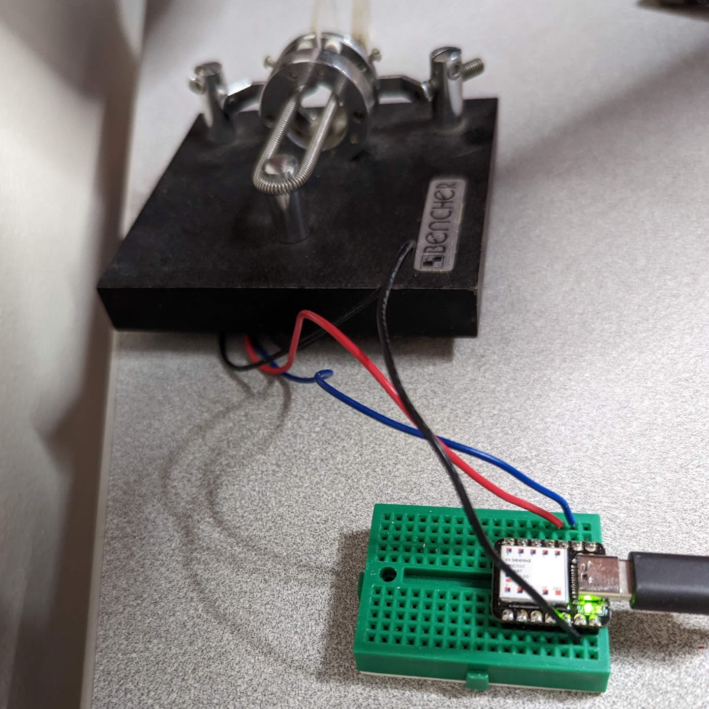

# Vail Adapter: Morse Code Key/Paddle to USB

# Features

* Lets you key even if you move focus to another window
* Works with [Vail](https://vail.woozle.org/)
* Works with [VBand](https://hamradio.solutions/vband/), but the window has to remain focused
* Optional sidetone generator, which helps with latency
* Implements all nine keyer modes from Vail, in the adapter, so you lunatics can try to key at 50WPM with no latency issues
* Plays received signals in the adapter, so you can turn off your computer speaker
* Free firmware updates for life
* Can be wired up in about 5 minutes

[Vail Adapter benefits video](https://www.youtube.com/watch?v=XQ-mwdyLkOY) (4:46)

# Setting Up

* [Easy Setup](doc/easy-install.md)
* [Advanced Setup](doc/advanced-install.md)

# Future Work

Things I plan to add:

* [x] PCB to ease assembly and make a more robust shippable product
* [ ] Debug tone changes
* [ ] PCB v2 to get the speaker on pin 10 instead of pin 9
* [ ] Unplug detection: send a pulse out one pin and detect it on the T pin to reset straight-key detection

# Contributing
To contribute to this project please contact neale@woozle.org
https://id.arduino.cc/neale

# Similar projects

* Vail user Michele Giugliano's 
  [MorsePaddle2USB](https://github.com/mgiugliano/MorsePaddle2USB),
  which runs on a DigiSpark (attiny85). It only sends keystrokes, so you must keep the Vail
  window focused: you can't switch to other apps and still transimit.
* Ham Radio Solutions sells a 
  [USB Paddle Interface](https://hamradio.solutions/vband/)
  which appears to be very similar to Michele's project. You must keep the 
  Vail window focused.
* [CWKeyboard](https://github.com/kevintechie/CWKeyboard) looks almost 
  exactly the same as the VBand adapter.
